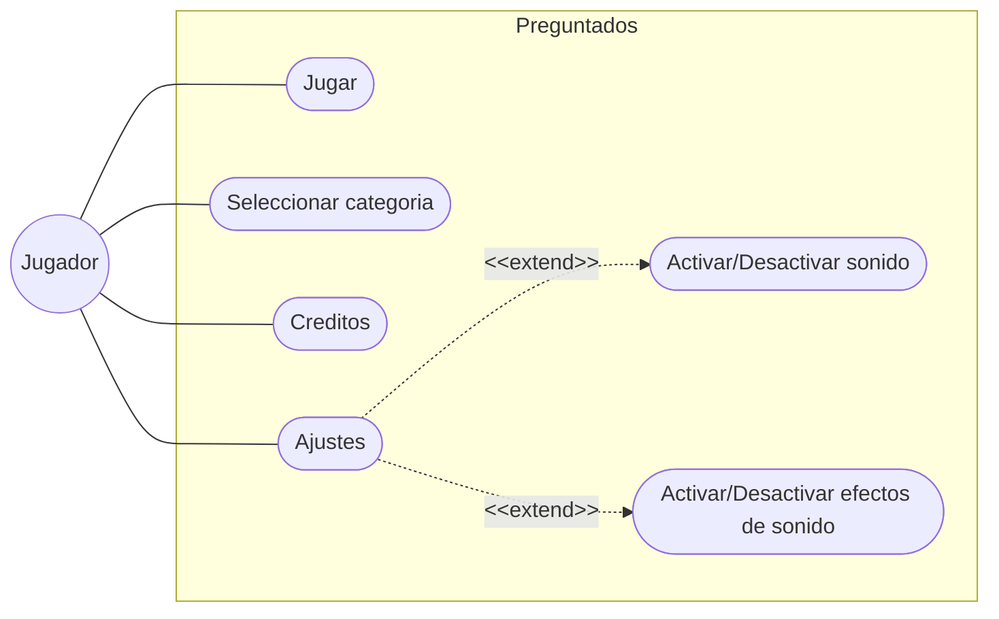

# ProyectoMinijuegoClase

Casos de uso creado


# Diagrama de Secuencia: Flujo de Respuesta

```mermaid
sequenceDiagram
    actor Jugador
    participant V as Vista
    participant C as Controlador
    participant M as Modelo

    Jugador->>V: Clic en Botón (Ej: A)
    V->>C: notificarClic(indiceBoton)
    
    activate C
    C->>M: comprobarRespuesta(indiceBoton)
    activate M
    
    alt Respuesta Correcta
        M-->>C: devuelve TRUE
        C->>V: cambiarColorFondo(Verde)
        C->>M: sumarPuntos()
    else Respuesta Incorrecta
        M-->>C: devuelve FALSE
        C->>V: cambiarColorFondo(Rojo)
        C->>M: restarVida()
    end
    
    deactivate M
    
    C->>V: actualizarTextos(Puntos, Vidas)
    deactivate C

 ```
