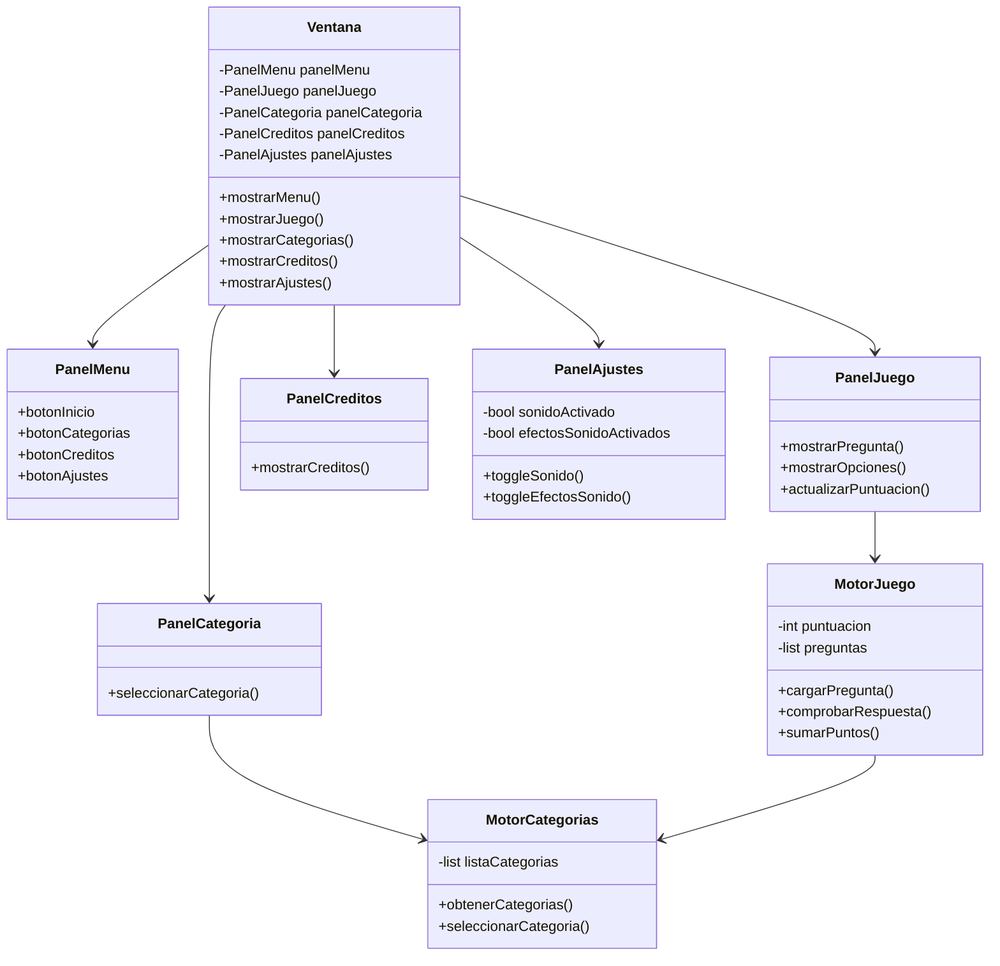

Diagrama de clases

```mermaid
classDiagram
direction TB
    class Ventana {
	    -PanelMenu panelMenu
	    -PanelJuego panelJuego
	    -PanelCategoria panelCategoria
	    -PanelCreditos panelCreditos
	    -PanelAjustes panelAjustes
	    +mostrarMenu()
	    +mostrarJuego()
	    +mostrarCategorias()
	    +mostrarCreditos()
	    +mostrarAjustes()
    }

    class PanelMenu {
	    +botonInicio
	    +botonCategorias
	    +botonCreditos
	    +botonAjustes
    }

    class PanelJuego {
	    +mostrarPregunta()
	    +mostrarOpciones()
	    +actualizarPuntuacion()
    }

    class PanelCategoria {
	    +seleccionarCategoria()
    }

    class PanelCreditos {
	    +mostrarCreditos()
    }

    class PanelAjustes {
	    -bool sonidoActivado
	    -bool efectosSonidoActivados
	    +toggleSonido()
	    +toggleEfectosSonido()
    }

    class MotorJuego {
	    -int puntuacion
	    -list preguntas
	    +cargarPregunta()
	    +comprobarRespuesta()
	    +sumarPuntos()
    }

    class MotorCategorias {
	    -list listaCategorias
	    +obtenerCategorias()
	    +seleccionarCategoria()
    }

    Ventana --> PanelMenu
    Ventana --> PanelJuego
    Ventana --> PanelCategoria
    Ventana --> PanelCreditos
    Ventana --> PanelAjustes
    PanelJuego --> MotorJuego
    PanelCategoria --> MotorCategorias
    MotorJuego --> MotorCategorias
```

