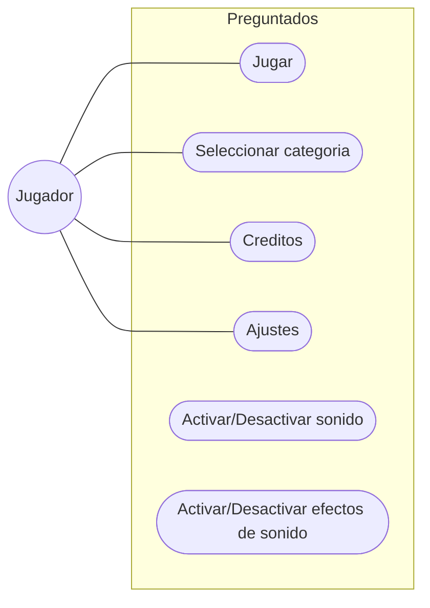

# ProyectoMinijuegoClase

```mermaid
graph LR
%% Actor
Jugador((Jugador))

%% Límite del Sistema
subgraph "Preguntados"
   
    CU1([Jugar])
    CU2([Seleccionar categoria])
    CU3([Creditos])
    CU4([Ajustes])
    CU5([Activar/Desactivar sonido])
    CU6([Activar/Desactivar efectos de sonido])


end

%% Relaciones actor-casos de uso
Jugador --- CU1
Jugador --- CU2
Jugador --- CU3
Jugador --- CU4
```

CU4 -.->|&lt;&lt;extend&gt;&gt;| CU5
CU4 -.->|&lt;&lt;extend&gt;&gt;| CU6
